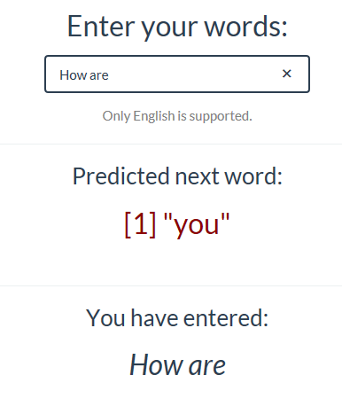

## Description

This is a sale pitch for [webApp](https://launeric.shinyapps.io/ShinyApp/) which predicts the next word.

This webApp is a capstone project for the Coursera Data Science specialization held by coursera & Johns Hopkins University and in cooperation with SwiftKey.

## Goal

- The  goal of this capstone project is to build a shiny application that is able to predict the next word of a sentence. 

## Data Source & Tools

- All text data that is used to create a frequency dictionary and thus to predict the next words comes from a corpus called [HC Corpora](http://www.corpora.heliohost.org/). 

- All text mining[TM](https://cran.r-project.org/web/packages/tm/index.html) and natural language processing[NLP](https://cran.r-project.org/web/packages/text2vec/index.html) was done with the usage of a variety of well-known R packages.

## Methods & Models

After acquiring the choosen text, a sample is taken which is then pre-processed by removing punctuation, links, white space, numbers and all kinds of special characters & conversing to lowercase.
This processed sample is then [tokenized](http://en.wikipedia.org/wiki/Tokenization_%28lexical_analysis%29) into so-called [*n*-grams](http://en.wikipedia.org/wiki/N-gram). 

Those aggregated bi-,tri- and quadgram term frequency matrices have been transferred into frequency tables.

The resulting n-gram frequency tables are used to predict the next word in connection with the text input by a user of the described application.

## Usage

Entering the word(s) of a sentence (**1**), the field with the predicted next word (**2**) refreshes instantaneously and  also the whole input (**3**) gets displayed.

## Additional Information

* This webApp is hosted on shinyapps.io: [https://launeric.shinyapps.io/ShinyApp/](https://launeric.shinyapps.io/ShinyApp/)

* The code can be found in this GitHub repo: [https://github.com/AH0HA/coursera_dsc_cpstn](https://github.com/AH0HA/coursera_dsc_cpstn)

